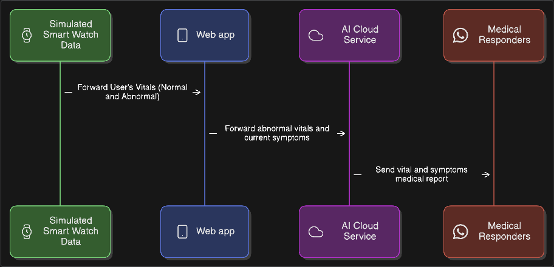

<p align="center">
  
</p>

---

# vAItal
A healthcare app that keeps you ever closer to medical responders.  
A free, AI-driven mobile safety system that utilizes smartwatch vitals and LLM-based emergency reasoning to autonomously detect life-threatening situations and instantly notify medical responders!

---

# 📊 System Workflow


---

# 🔐 Environment Variables

This project requires a `.env` file to run.  
Your actual `.env` file **must NOT be uploaded** to GitHub.

Instead, a `.env.template` file is included which lists the required variable names.

Create a `.env` file in the project root and add:

```bash
# AI / LLM Providers
GEMINI_API_KEY=your_gemini_api_key_here

# SMS Alert System (Twilio)
TWILIO_ACCOUNT_SID=your_twilio_account_sid_here
TWILIO_AUTH_TOKEN=your_twilio_auth_token_here
TWILIO_FROM_NUMBER=your_twilio_phone_number_here

# Emergency Contact
DOCTOR_PHONE_NUMBER=recipient_phone_number_for_alerts
